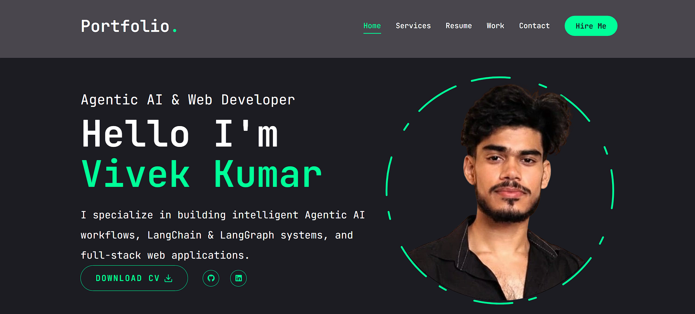

# My Portfolio Website

Welcome to my portfolio website built using React, Next.Js, Framer Motion & Tailwind CSS!

## Overview

This repository contains the code for my personal portfolio website, showcasing my projects, skills, and experiences as an aspiring developer/designer. The website is built using Framer Motion, Tailwind CSS & React & Next.js.



## Features

- **Responsive Design**: The website is designed to adapt seamlessly to various screen sizes, ensuring optimal viewing experience across devices.
- **Project Showcase**: Explore the projects I've worked on, including web applications, mobile apps, and other software projects. Each project is presented with a brief description, key technologies used, and links to live demos or GitHub repositories.
- **Skills & Expertise**: Learn about my technical skills, programming languages, frameworks, and tools I'm proficient in. Whether it's front-end development, back-end development, or design, I'm passionate about continuously learning and improving.
- **About Me**: Get to know me better! Discover my background, education, professional experience, interests, and what drives me as a developer.
- **Contact Information**: Interested in collaborating on a project or just want to say hello? Reach out to me through the provided contact information, including email and social media links.

## Getting Started

To get a local copy up and running follow these simple steps:

1. Clone the repository
   ```sh
   git clone https://github.com/vivek072003/my-portfolio.git

   ```
2. Navigate into the project directory
   ```sh
   cd my-portfolio

   ```
3. Install dependencies
   ```sh
   npm i

   ```
4. Start the development server
   ```sh
   npm run dev

   ```
5. Open [http://localhost:3000](http://localhost:3000) in your browser to view the website.

## Feedback

I've put a lot of effort into creating this portfolio, and I'm eager to hear your feedback! Whether you're a fellow developer, potential employer, or just a curious visitor, feel free to explore the website, suggest improvements, or drop me a message. Let's connect and build something amazing together! 🌟

If you find this project helpful or interesting, don't forget to star the repository and share it with your network.

## Contact

For any inquiries or collaboration opportunities, you can reach me via:

- Email: [Get In touch](mailto:vivekmicromax2005@gmail.com)
- LinkedIn: [LinkedIn](https://www.linkedin.com/in/vivekkumar1107/)
